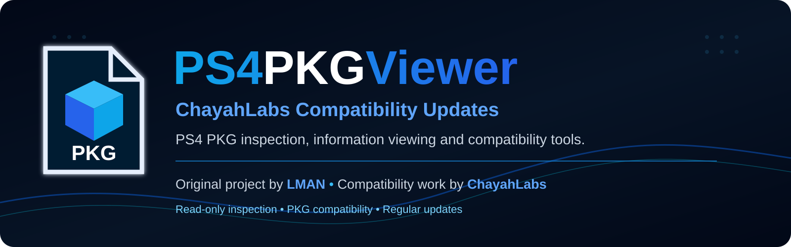
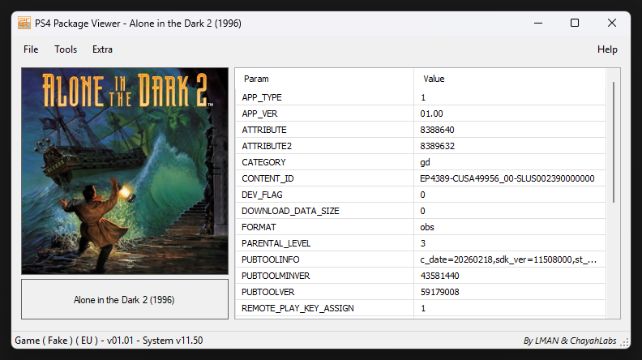

<!-- CHAYAHLABS-README-HERO:BEGIN -->
<p align="center">
  
</p>

<p align="center">
  <a href="https://github.com/ChayahLabs/PS4PKGViewer-ChayahLabs/releases/latest"></a>
  <a href="https://github.com/ChayahLabs/PS4PKGViewer-ChayahLabs/releases"></a>
  <a href="https://github.com/ChayahLabs/PS4PKGViewer-ChayahLabs/issues"></a>
  <a href="https://github.com/ChayahLabs/PS4PKGViewer-ChayahLabs/stargazers"></a>
  <a href="https://github.com/ChayahLabs/PS4PKGViewer-ChayahLabs/network/members"></a>
</p>

<p align="center">
  <strong>PS4 PKG inspection and compatibility updates for the original PS4PKGViewer by LMAN.</strong>
</p>
<!-- CHAYAHLABS-README-HERO:END -->

# PS4PKGViewer v1.6.6 — ChayahLabs List Contents Size Accuracy Update

PS4PKGViewer is a Windows utility originally created by **LMAN <LeecherMan>** for viewing information and contents from PlayStation 4 PKG files.

This repository documents and distributes the **ChayahLabs compatibility updates for PS4PKGViewer**, with **v1.6.6** as the current release.

> Special thanks to **LMAN <LeecherMan>**, the original creator of PS4PKGViewer. Without his work, these compatibility updates would not have been possible.

<!-- CHAYAHLABS-SCREENSHOT:BEGIN -->
## Screenshot

<p align="center">
  
</p>
<!-- CHAYAHLABS-SCREENSHOT:END -->

## Current release

**PS4PKGViewer v1.6.6 — ChayahLabs List Contents Size Accuracy Update**

- Release: https://github.com/ChayahLabs/PS4PKGViewer-ChayahLabs/releases/tag/v1.6.6
- Archive: `PS4PKGViewer.v1.6.6-LMAN_ChayahLabs.rar`
- Archive format: **RAR 4.x** with a native archive comment
- SHA256: `44A0490FD8D3DD7B9D743651CF1D535918BAE77427DFB1FC8274DF438FCBC762`

## What's new in v1.6.6

### List Contents size accuracy

- Fixed affected compatible PS4 Fake PKGs whose `Image0` files could incorrectly appear as **0 Bytes**.
- Preserves every existing non-zero List Contents size.
- For a zero-size file only, performs an exact path lookup against the inner PFS metadata.
- Replaces a false zero only when the exact inner-PFS entry proves a logical size greater than zero.
- Genuine zero-byte files remain **0 Bytes**.
- Missing or inaccessible PFS metadata preserves the previous Viewer result instead of guessing.
- No compressed-size fallback is used.

### Decrypted-size correction

- Corrected **Properties > Decrypted-size** so it reflects the final logical file list after any valid zero-size corrections.
- The aggregate is recomputed from the final `PkgCabinet` state, making repeated execution idempotent.

### Fast read-only PFS metadata fallback

- Added `ChayahLabs.PS4SizeFallback.dll` as the compatibility bridge.
- Added a small .NET 8 PFS-size probe under `ChayahLabs.Runtime`.
- Added in-memory PFS-size caching so repeated List Contents access to the same package avoids repeating the metadata probe.
- The fallback is silent and read-only; no extraction is introduced.
- If the PFS cannot be inspected, the original zero-size result is preserved.

### Portable runtime layout

- Moved the size-probe support files into `ChayahLabs.Runtime` to keep the release root clean.
- `LibOrbisPkg.Core.dll` remains an external, replaceable file in that runtime folder.
- Added the upstream LibOrbisPkg license and expanded third-party notices to the binary distribution.
- `PS4PKGViewer.bin` is **not** distributed; it is generated locally by the Viewer as user configuration when needed.

### Retained compatibility work

- Retains the v1.6.5 **ICON0 Compatibility Update**.
- Retains the v1.6.4 **List Contents**, PFS crypto, update metadata and `SYSTEM_VER` compatibility work.
- Updated About, AssemblyVersion, FileVersion, ProductVersion and Readme to v1.6.6.

## v1.6.6 validation

- **Hulu / CUSA00131:** 11 false zero-size files corrected.
- **FPKGi v1.10.0:** genuine zero-byte `Media/boot.config` preserved.
- **CUSA49956 sample:** 157 false zero-size files corrected.
- **WatchESPN / CUSA05214:** existing valid non-zero sizes preserved.
- Repeated access to the same package uses the in-memory size cache.

## Retained v1.6.5 ICON0 compatibility work

- Fixed missing package icons in some rebuilt or non-standard PS4 PKGs.
- Fixed compatibility with packages affected by the legacy `ENTRY_NAMES` positional association behavior.
- Added a fast direct `ICON0` metadata-entry fallback.
- Preserved the original icon-loading path for packages that already work.
- Uses direct package metadata lookup for `ICON0_PNG` (`0x1200`) and supported variants when the legacy association is invalid.
- Reads compatible unencrypted icon data directly from its package `DataOffset` / `DataSize`, avoiding external PkgTool processes in the normal fallback path.
- Embedded the secondary **LibOrbisPkg / PkgTool 0.2.231.2** ICON0 runtime inside `ChayahLabs.PS4IconFallback.dll`.
- The secondary ICON0 runtime is materialized to Windows TEMP only when actually required.

## Retained v1.6.4 compatibility work

- Improved **List Contents** support for newer and rebuilt PS4 packages.
- Added a **LibOrbisPkg / PkgTool 0.2.231.2 compatibility fallback** for Fake PKGs.
- Added automatic fallback for packages that expose the newer PFS crypto flag but still require the legacy PFS key derivation.
- Fixed `inode 0 is corrupt` and empty List Contents failures affecting compatible FPKGs.
- Fixed `SYSTEM_VER` formatting for PS4 firmware versions **10.00 and newer**.
- Replaced the discontinued Octolus integration with **ORBISPatches**.
- Added Sony update metadata support, **Copy Links** and **Save Updates**.

## Requirements

- Windows x64
- Microsoft .NET Framework 4.0 or newer
- Microsoft .NET 8 Runtime (x64)
- PowerShell 7 (`pwsh.exe`)

## Distribution files

The v1.6.6 binary release contains exactly:

```text
PS4PKGViewer.v1.6.6-LMAN_ChayahLabs/
├── PS4PKGViewer.exe
├── PS4PKGViewer.dat
├── PS4UpdateInfo.ps1
├── Readme.txt
├── ChayahLabs.PS4IconFallback.dll
├── ChayahLabs.PS4SizeFallback.dll
├── LICENSE-LibOrbisPkg.txt
├── THIRD_PARTY_NOTICES.txt
├── SHA256SUMS.txt
└── ChayahLabs.Runtime/
    ├── ChayahLabs.PS4PfsSizeProbe.exe
    ├── ChayahLabs.PS4PfsSizeProbe.dll
    ├── ChayahLabs.PS4PfsSizeProbe.deps.json
    ├── ChayahLabs.PS4PfsSizeProbe.runtimeconfig.json
    └── LibOrbisPkg.Core.dll
```

Keep the complete portable release together. `ChayahLabs.Runtime` is required by the v1.6.6 size-accuracy fallback.

The secondary ICON0 fallback runtime from v1.6.5 remains embedded in `ChayahLabs.PS4IconFallback.dll` and is materialized under Windows TEMP only if that secondary fallback is needed.

## Download

Use the **Releases** section of this repository to download the packaged build.

The current release archive is:

```text
PS4PKGViewer.v1.6.6-LMAN_ChayahLabs.rar
```

SHA256:

```text
44A0490FD8D3DD7B9D743651CF1D535918BAE77427DFB1FC8274DF438FCBC762
```

The release also includes a `.sha256.txt` asset for verification.

The v1.6.6 archive is a true **RAR 4.x** archive with a native archive comment for compatibility with tools such as PowerArchiver.

## Bugs, compatibility reports and improvements

Bug reports, compatibility problems, new ideas and feature suggestions are welcome.

Please open a **GitHub Issue** and include, when possible:

- Title ID / Content ID
- Base game or update
- Official PKG or Fake PKG
- `SYSTEM_VER`
- PS4PKGViewer error message
- Relevant `%TEMP%\PS4PKGViewer_IconFallback.log` output for icon problems, when generated
- Relevant `%TEMP%\PS4PKGViewer_ChayahFallback.log` output for legacy List Contents / package fallback problems, when generated
- Steps needed to reproduce the issue

The v1.6.6 PFS-size fallback itself is intentionally silent and does not create a persistent diagnostic folder during normal use.

## Acknowledgements

Special thanks to:

- **LMAN <LeecherMan>** — original author of PS4PKGViewer.
- **[Maxton](https://github.com/maxton)** and the contributors to **[LibOrbisPkg / PkgTool](https://github.com/maxton/LibOrbisPkg)** — the open-source PKG/PFS/SFO library and tooling used by the compatibility fallbacks.
- **ORBISPatches** and its contributors.
- Everyone involved in PS4 package research, documentation, development, testing and community support.
- Users who report compatibility issues and suggest improvements.

## Project history

The original **v1.0–v1.5** PS4PKGViewer releases were created by LMAN.

The **v1.6.4 ChayahLabs Compatibility Update** focused on newer/rebuilt package listing, PFS crypto compatibility, update metadata and newer firmware-version formatting.

The **v1.6.5 ChayahLabs ICON0 Compatibility Update** added a dedicated compatibility path for packages whose legacy `ENTRY_NAMES` positional association can point `icon0.png` at the wrong package entry, while preserving the original behavior for packages that already work.

The **v1.6.6 ChayahLabs List Contents Size Accuracy Update** corrects false zero-byte List Contents entries using exact inner-PFS logical-size metadata, preserves genuine zero-byte files, corrects Decrypted-size and adds a clean portable runtime layout for the size probe.

See [CHANGELOG.md](CHANGELOG.md) for the detailed changes and [RELEASE_NOTES-v1.6.6.md](RELEASE_NOTES-v1.6.6.md) for the current release notes.

## Legal / licensing notice

This repository contains compatibility work and documentation maintained by ChayahLabs.

PS4PKGViewer and any third-party components remain the property of their respective authors and copyright holders. See [THIRD_PARTY_NOTICES.md](THIRD_PARTY_NOTICES.md).

LibOrbisPkg remains subject to its upstream **LGPL-3.0** license. The binary distribution includes `LICENSE-LibOrbisPkg.txt`, and `LibOrbisPkg.Core.dll` used by the v1.6.6 size fallback remains an external, replaceable runtime component.

No affiliation with Sony Interactive Entertainment is claimed or implied.

## Credits

**Original author:**  
LMAN <LeecherMan> (2018)

**Compatibility updates:**  
ChayahLabs (2026)

https://github.com/ChayahLabs

## Project documentation

- [Changelog](CHANGELOG.md)
- [v1.6.6 release notes](RELEASE_NOTES-v1.6.6.md)
- [Contributing](CONTRIBUTING.md)
- [Support](SUPPORT.md)
- [Security policy](SECURITY.md)
- [Third-party notices](THIRD_PARTY_NOTICES.md)